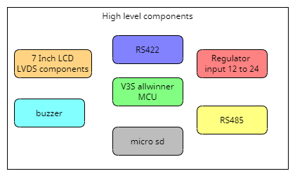

# E4G_Project_0

## Project Backlog:
1. Supply 12-24V AC or DC
2. Core V3S Allwinner
3. LCD 7-Inch LVDS 40-Pin
4. Connections:
   - RS422 (non-isolated connection, JST-2mm socket)
   - RS485 (non-isolated connection, JST-2mm socket)
5. SD Card with SWID or HSPI interface
6. Buzzer

## Project Schematic Rules:

- Each block must have a specific sheet.
- File annotation format: UpperCamelCase.
- Schematic sheet size must be A4.
- Grids must be set at 50mil.
- Utilize the built-in library with valid links to suppliers like [Digikey](https://www.digikey.com) or [Mouser](https://www.mouser.com).
- Follow power nets conventions similar to Altium samples.
- NetLabel or ports text format: UpperCamelCase.
- Use ports for sheet inputs and outputs.
- Ensure that ports have the correct flow.
- Include PCB rules in the schematic.
  

## Commit Message Guidelines

We follow the [Conventional Commits](https://www.conventionalcommits.org/en/v1.0.0/) specification for our project's commit messages. This helps maintain a standardized format for commit messages, making it easier to understand the purpose and context of each change in our project.

